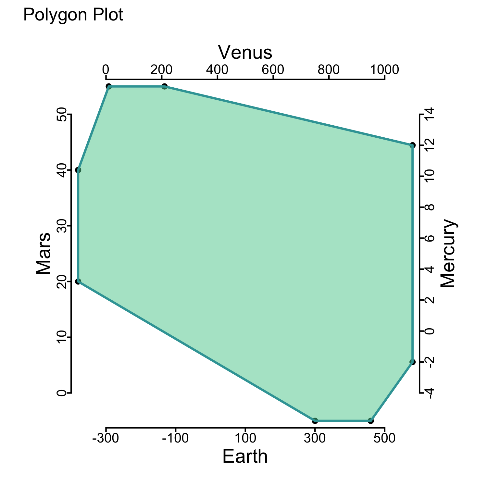

<!-- README.md is generated from README.Rmd. Please edit that file -->

# polygonPlot

<!-- badges: start -->

[](https://github.com/giovannellilab/polygonPlot/actions/workflows/R-CMD-check.yaml)
[](https://www.repostatus.org/#active)
[](https://cran.r-project.org/web/licenses/MIT)
<!-- badges: end -->

A **Polygon plot** (singular, Polygons plot, plural) is designed to
visualize multivariate ranges as opposite to single data points. The
concept of `polygons plot` was developed by [Donato
Giovannelli](https://www.donatogiovannelli.com/) in late 2018 while
working on our review [Living at the Extremes: Extremophiles and the
Limits of Life in a Planetary
Context](https://doi.org/10.3389/fmicb.2019.00780), published in 2019 in
Frontiers in Microbiology.

A complete explanation of how polygon plot works can be found at
<https://giovannellilab.github.io/polygonPlot/>.

<details>
<summary>
Story Details
</summary>

While working on the review, he started collecting data regarding the
range (minimum and maximum) for physico-chemical parameters of Earth’s
life such as pH, temperature, salinity and pressure. He wanted to
visualize the ranges of these variables in a single plot, but I could
not find a simple way to do it. After some research and a lot of
doodling, the polygons plot was born!


</details>

## Installation

You can install the development version of polygonPlot from
[GitHub](https://github.com/giovannellilab/polygonPlot) with:

``` r
# install.packages("devtools")
devtools::install_github("giovannellilab/polygonPlot")
```

## Example usage

This is a basic example which shows you how to solve a common problem:

``` r
library(polygonPlot)

df <- read.csv(system.file(file.path("extdata", "example.csv"), package="polygonPlot"))
df
#>        info data1 data2 data3 data4 data5 data6
#> 1  axis_min  -300    -4     0     0    NA  -0.5
#> 2  axis_max   500    14  1000    50    NA   0.5
#> 3      data   300    -2    10    20     5   0.1
#> 4             320    12    50    40    10   0.3
#> 5             340    NA    90    NA    NA    NA
#> 6             360    NA   130    NA    NA    NA
#> 7             380    NA   170    NA    NA    NA
#> 8             400    NA   210    NA    NA    NA
#> 9             420    NA    NA    NA    NA    NA
#> 10            440    NA    NA    NA    NA    NA
#> 11            460    NA    NA    NA    NA    NA
```

``` r
plot <- polygonplot(df, shape = 4, fillcolor = "#57cc99", linecolor = "#38a3a5",
                    labels_axis = c("Earth", "Mercury", "Venus", "Mars"))
plot
```


